  

# Hi 👋 My name is Pedro Souza

## Software Engineer & Co-founder @ Toca

Co-founder and engineer at [Toca](https://toca.com.vc), an AI chat SaaS for small and medium e-commerce businesses. I focus on software architecture, LLMs, and AI systems — building the pipelines that let chat products actually reason and act.

- 🌍 Based in São Paulo, Brazil
- 🚀 Currently building [Toca](https://toca.com.vc)
- 🧠 Into software architecture, LLMs, and AI systems
- 🤝 Open to talking shop about AI product architecture

### Social Media

  
  <!-- swap in your LinkedIn/X handles here, e.g.: -->
  <!--  -->

### Badges

**GitHub Stats**

  

  

