<!-- hero: monochrome ASCII portrait (types in) beside the extruded 3d ascii
     wordmark (wipes in left-to-right, then rocks on its vertical axis).
     widths are picked so both panels land at the same height.
     portrait: python scripts/prep_photo.py <photo> && python scripts/make_ascii_svg.py
     wordmark: python scripts/make_wordmark_svg.py --mode rock
     how the wordmark is built: docs/3d-ascii-wordmark.md -->

<h3><code>peu@github ~ $ whoami</code></h3>

<table>
<tr>
<td valign="top"></td>
<td valign="top"></td>
</tr>
</table>

 
 

<!-- animated contribution graph: real data, boxes reveal cell by cell
     (regenerated daily by .github/workflows/update-profile-art.yml) -->

<h3><code>peu@github ~ $ ./contributions.sh</code></h3>

 
 

<h3><code>peu@github ~ $ ./links.sh</code></h3>

<b>Software Engineer · AI Builder · Co-founder @ Toca</b>

 

